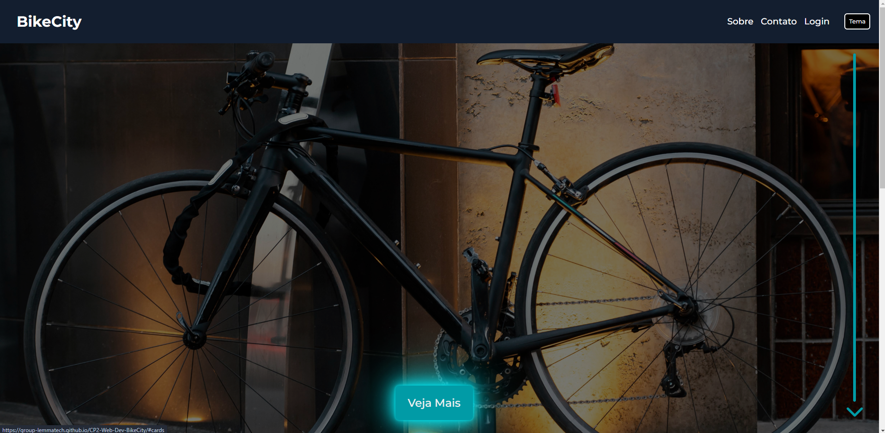

# BikeCity

Este projeto foi realizado para a disciplica de Web Development, com o foco em criar um website interativo sobre bicicletas. Podendo realizar um quiz quando realizado o login, com perguntas sobre bicicletas. 

# Tecnologias

- HTML
- CSS
- JavaScript

# Funcionalidades

- Página inicial com um slideshow e card com bicicletas.
- Botão interativo que muda o tema da página
- Página de login para acessar o quiz.
- Página de contato (fictício).
- Página sobre falando um pouco sobre a bikecity.
- Quiz interativo.

# Como acessar (links)

- [Site](https://group-lemmatech.github.io/CP2-Web-Dev-BikeCity/)

- [Repositório](https://github.com/luyz-gusta/Projeto-Lion-School-2023-Front) - Você está aqui 🚩

# Colaboradores

|                                                                                                             |                                                                                                                                                              |
| ----------------------------------------------------------------------------------------------------------- | ------------------------------------------------------------------------------------------------------------------------------------------------------------ |
|  |   |
|  |   |
|  |   |
|  |   |
|  |              |
